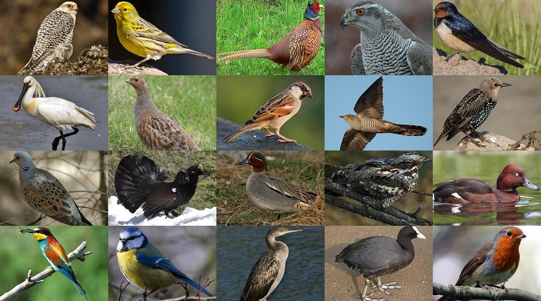
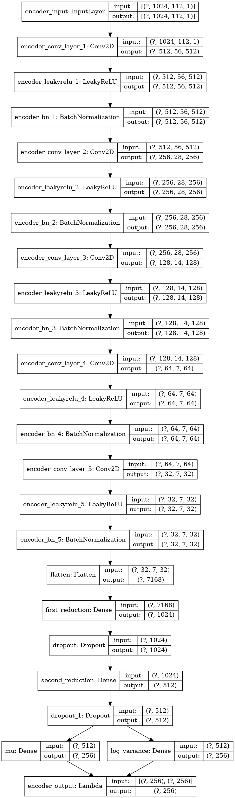
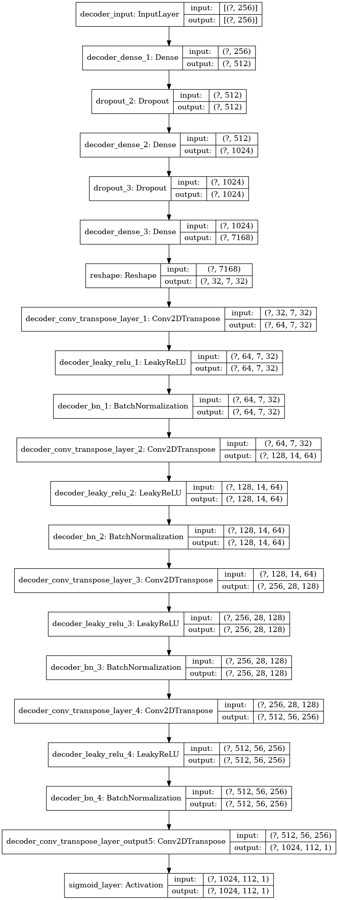
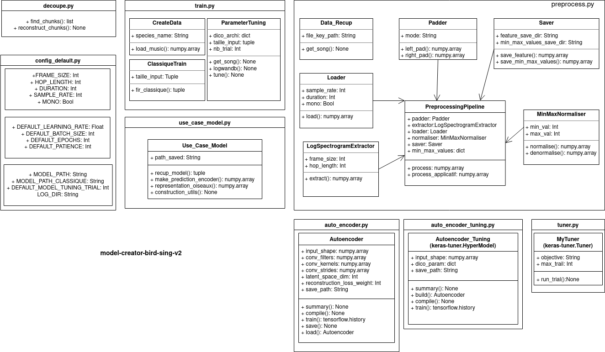

# IA singing bird

This is my final project of my engineering school. It has been made in one month with an other student
who works in cloud computing. The idea was to generate birds songs with an Artificial Intelligence. We
started with a tutorial from Valerio Velardo on sound VAE. We changed a bit the model to make it more 
more complex. We trained the model on Deep Learning machins because we needed GPU. Moreover, we tried 
different achitectures to find the best model.

## The model

The final model has the following architecture :

## How to use the model with the library

In order to use our work we have built the following library with an architecture that includes data preprocessing and 
model training.

This work is made to be test and used again by professionals of birds. You can install this part of the work on Pypi :

**pip install model-creator-bird-sing-v2**

It is strongly recommended to run the training on machines with GPUs, otherwise the training can take an extremely long time, especially when tuning the model.